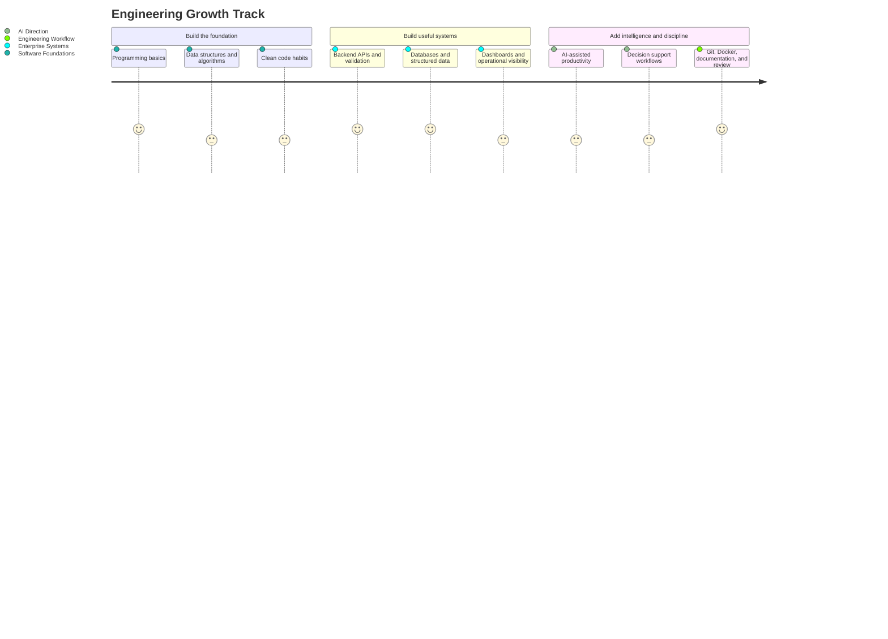

<div align="center">


<br />
<br />

<a href="#-about-me"></a>
<a href="#-core-focus"></a>
<a href="#-tools--technologies"></a>

<br />

<a href="#-current-learning-path"></a>
<a href="#-solutions-im-learning-to-build"></a>
<a href="#-development-roadmap"></a>

<br />
<br />

<a href="mailto:qusaigubran24@gmail.com"></a>
<a href="https://www.linkedin.com/in/qusai-gubran-b34240306/"></a>
<a href="https://github.com/qusaigubran"></a>

</div>

---

## 👋 About Me

I am a Computer Science student learning how **software**, **data**, **workflows**, and **AI** can support reliable enterprise solutions.

I am building my foundation in **software engineering**, **backend systems**, **structured data**, and **AI-assisted business workflows**.

My focus is to understand the business process first, then design systems that are simple to use, structured to maintain, and practical enough to improve real operations.

---

## ⚡ Core Focus

<div align="center">


</div>

```text
Business Problem
      ↓
Workflow Understanding
      ↓
Structured Data + Backend Logic
      ↓
AI Enablement + Operational Automation
      ↓
Reliable Enterprise Solution
```

<div align="center">


</div>

**Focus areas inside the pipeline:**

- **Enterprise Solutions:** business systems, internal platforms, workflow structure, and operational visibility.
- **AI Enablement:** practical AI support for productivity, decisions, and smarter workflows.
- **Backend Systems:** APIs, validation, business rules, and structured data handling.
- **Operational Automation:** integrations, dashboards, repeated-task reduction, and error prevention.

---

## 🧰 Tools & Technologies

<div align="center">


</div>

<br />

<table>
  <tr>
    <td width="50%" valign="top">
      <h3>Software Foundations</h3>
      <p>
        
        
        
        
        
      </p>
      <sub>Programming basics, structure, scripting, and problem solving.</sub>
    </td>
    <td width="50%" valign="top">
      <h3>Frontend & App Layer</h3>
      <p>
        
        
        
        
        
      </p>
      <sub>Interfaces, screens, dashboards, forms, and user-facing workflows.</sub>
    </td>
  </tr>
  <tr>
    <td width="50%" valign="top">
      <h3>Backend & Data</h3>
      <p>
        
        
        
        
        
      </p>
      <sub>Business logic, validation, structured data, and reliable behavior.</sub>
    </td>
    <td width="50%" valign="top">
      <h3>Enterprise & AI</h3>
      <p>
        
        
        
        
        
      </p>
      <sub>Enterprise visibility, decision support, and AI-assisted operations.</sub>
    </td>
  </tr>
  <tr>
    <td width="50%" valign="top">
      <h3>Automation & Operations</h3>
      <p>
        
        
        
        
        
      </p>
      <sub>Connecting tools, reducing repetition, and improving execution.</sub>
    </td>
    <td width="50%" valign="top">
      <h3>Developer Workflow</h3>
      <p>
        
        
        
        
        
      </p>
      <sub>Version control, development environment, containers, and organization.</sub>
    </td>
  </tr>
</table>

---

## 🧠 Current Learning Path

<div align="center">


</div>



<div align="center">


</div>

**Current learning direction:** build strong foundations, convert business workflows into structured systems, then add AI where it supports real decisions or reduces repeated work.

---

## 🚀 Solutions I’m Learning to Build

<div align="center">


</div>

<br />

| Learning Domain | What I’m Practicing | What I’m Learning From It |
|---|---|---|
| **Enterprise Systems** | Small business workflows, internal tools, and structured operational screens. | How organizations translate real processes into software systems. |
| **AI-Assisted Workflows** | AI support for productivity, summaries, decisions, and repeated tasks. | Where AI adds practical value and where normal logic is enough. |
| **Backend APIs** | Validation, business rules, structured data, and API behavior. | How reliable systems protect data and control the critical path. |
| **Dashboards & Visibility** | CRM views, tracking screens, reporting, and operational status. | How data becomes useful when it is organized and visible. |
| **Automation Workflows** | Tool integrations, notifications, and repetitive task reduction. | How automation improves execution without replacing system design. |

<div align="center">


</div>

---

## 🧭 Build Compass

<div align="center">


</div>

```text
Understand the workflow before choosing tools.
Keep the first version small and reliable.
Protect the critical path with validation and clear logic.
Use AI and automation only when they add real value.
Review, document, and improve after the system works.
```

---

## 🗺️ Development Roadmap

| Stage | Focus | Outcome |
|---|---|---|
| Now | Software foundations, business workflows, Git/GitHub | Build clean small systems and understand operational problems. |
| Next | Backend APIs, databases, dashboards, Docker workflows | Build more reliable enterprise-style systems with structured data. |
| Later | AI-assisted enterprise solutions and scalable business tools | Improve productivity, decisions, and operational processes. |

---

## 🎯 Goal

To grow into a capable software developer who can build useful, reliable, and well-structured enterprise solutions supported by AI, data, and practical system design.

---

<div align="center">

### Learning by building. Improving through enterprise-focused systems.


</div>
