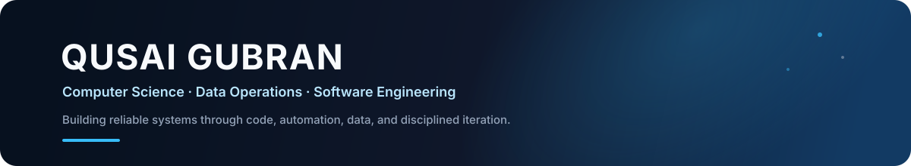

 

---

## About

**Computer Science Student · Aspiring Software Engineer**

I am building strong foundations in **programming, software engineering, web systems, data, and automation** through structured study and practical projects.

Currently studying **OSSU Computer Science** and **MIT 6.100L**, with a focus on problem solving, backend foundations, and writing reliable software.

---

## Featured Projects

| Project | Focus | Status |
|---|---|---|
| [**PEONISA**](https://peonisa.com/) · [GitHub](https://github.com/qusaigubran/peonisa_web) | Shopify storefront, Liquid, responsive UI, Arabic/English, RTL, product UX | Active |
| **Personal Portfolio** | Frontend architecture, reusable UI, responsive design, Git workflow | Ongoing |
| **Python Task API** | Python, FastAPI, REST, validation, CRUD, SQLite, automated tests | Learning |

---

## Stack

  

---

## Current Focus

**Software Engineering · Backend Systems · Data & Automation · Algorithms & CS Fundamentals**

My goal is to become a software engineer capable of building **reliable, scalable, and responsible systems**.

---

  

